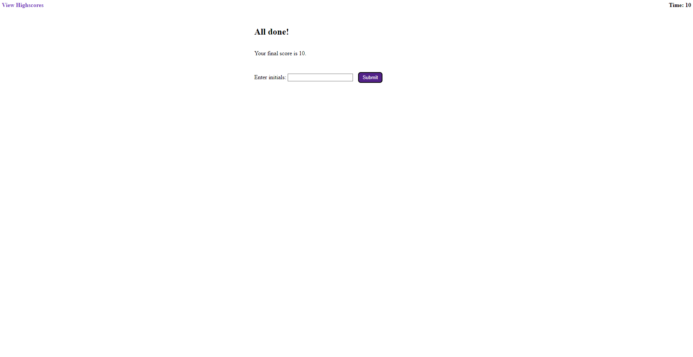

# Module 4 Challenge

## Description
This is a short but challenging coding quiz designed to test your basic knowledge of code, that provides feedback, and records your high score for you to view at another time. 
This was created in order to push my own knowledge and test my skills. 

 ## Table of Contents
-[Installation]
-[Usage]
-[License]
-[URL]
 ## Installation
In order to use this application, you will only need a basic web browser. Any will work, whether it be Microsoft Edge, Google Chrome, Mozilla Firefox, or even Internet Explorer.

## Usage
In order to use this website you will need to type in your browser "StyngerBee.github.io/curransmodule3passwordgenerator".

After that you can simply hit generate password and follow the commands given to you. Images below;

## License
MIT License

Copyright (c) 2022 Curran Duke

Permission is hereby granted, free of charge, to any person obtaining a copy of this software and associated documentation files (the "Software"), to deal in the Software without restriction, including without limitation the rights to use, copy, modify, merge, publish, distribute, sublicense, and/or sell copies of the Software, and to permit persons to whom the Software is furnished to do so, subject to the following conditions:

The above copyright notice and this permission notice shall be included in all copies or substantial portions of the Software.

THE SOFTWARE IS PROVIDED "AS IS", WITHOUT WARRANTY OF ANY KIND, EXPRESS OR IMPLIED, INCLUDING BUT NOT LIMITED TO THE WARRANTIES OF MERCHANTABILITY, FITNESS FOR A PARTICULAR PURPOSE AND NONINFRINGEMENT. IN NO EVENT SHALL THE AUTHORS OR COPYRIGHT HOLDERS BE LIABLE FOR ANY CLAIM, DAMAGES OR OTHER LIABILITY, WHETHER IN AN ACTION OF CONTRACT, TORT OR OTHERWISE, ARISING FROM, OUT OF OR IN CONNECTION WITH THE SOFTWARE OR THE USE OR OTHER DEALINGS IN THE SOFTWARE.

## URL 
[Coding Quiz](https://styngerbee.github.io/mod4codingquiz/)
